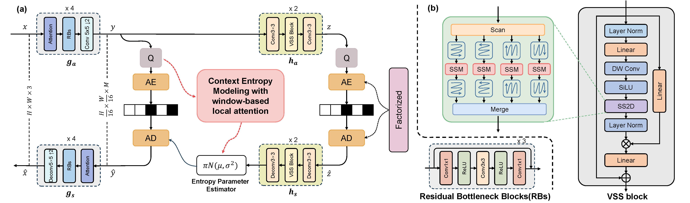
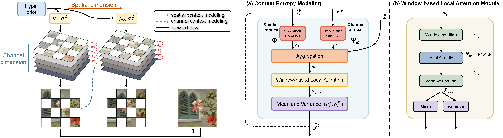
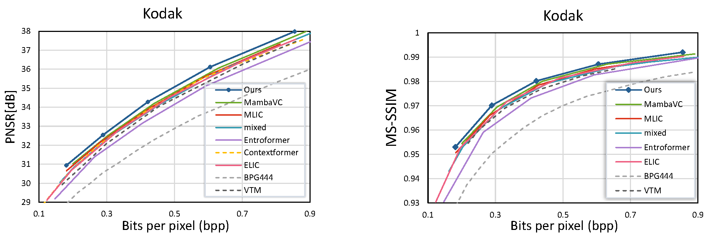

# MambaIC: State Space Models for High-Performance Learned Image Compression (CVPR 2025)

This repo is the official implementation of CVPR 2025 paper

> MambaIC: State Space Models for High-Performance Learned Image Compression
>
> Fanhu Zeng, Hao Tang, Yihua Shao, Siyu Chen, Ling Shao, Yan Wang

**Key words: Learned image compression, State space model, Context model.**


## Abstract


## Architecture



spatial-channel context model


## Environmental Setup
### Install CompressAI
```
git clone https://github.com/InterDigitalInc/CompressAI compressai
cd compressai
pip install -U pip && pip install -e .
```

### Install Vmamba
```
git clone https://github.com/MzeroMiko/VMamba.git
cd VMamba
cd kernels/selective_scan && pip install .
```
### Dataset


###

## Training 
```
```

## Evaluation
```
```

## Experimental Results



## :blue_book: Citation
If you find this work useful, consider giving this repository a star :star: and citing :bookmark_tabs: our paper as follows:

```bibtex

```

## Note
This is not the exact original code and is a re-implementation of our CVPR 2025 paper. But the core code and experimental results are almost the same, with slight difference.

## Acknowledgememnt

The code is based on [CompressAI](https://github.com/InterDigitalInc/CompressAI), [Mamba](https://github.com/state-spaces/mamba), [Vmamba](https://github.com/MzeroMiko/VMamba), [MambaVision](https://github.com/NVlabs/MambaVision), [ELIC](https://github.com/VincentChandelier/ELiC-ReImplemetation), [MambaVC](https://github.com/QinSY123/2024-MambaVC). Thanks for these great works and open sourcing! 

If you find them helpful, please consider citing them as well. 
